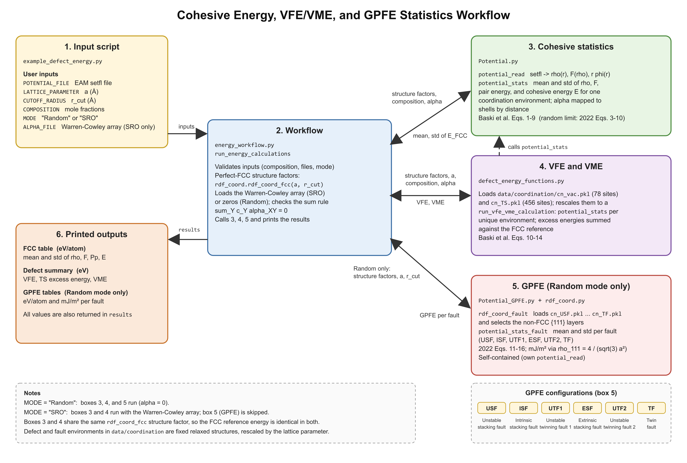
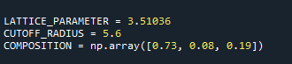
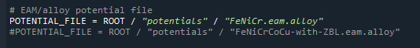
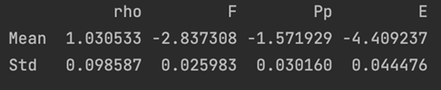
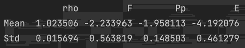
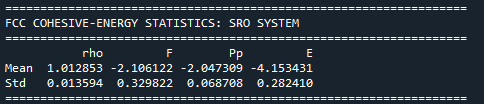
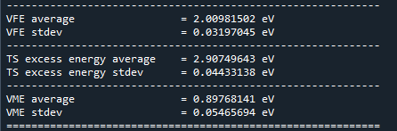
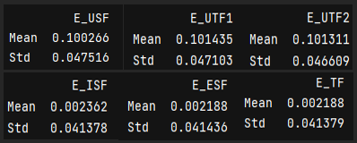
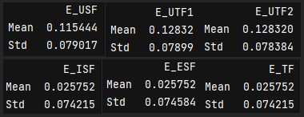

# Solid-Solution Energy Statistics

## Overview

This repository provides analytical tools for calculating statistical distributions of energy landscapes in concentrated solid solutions (CSSs) described by embedded-atom method (EAM) potentials.

The current implementation supports calculations of:

* FCC cohesive-energy statistics for Random systems as well as ordered CSSs.
* Vacancy formation energy (VFE) statistics for Random and ordered systems CSSs.
* Vacancy migration energy (VME) statistics for Random and ordered systems CSSs.
* Transition-state (TS) excess-energy statistics for Random and ordered systems CSSs.
* Generalized planar fault energy (GPFE) statistics for random alloys for Random CSSs. 


To perform a calculation, the user must provide:

* an EAM/alloy potential file in `setfl` format;
* the alloy composition, `COMPOSITION`;
* the lattice parameter, `LATTICE PARAMETER`;
* the cutoff radius, `CUTOFF\_RADIUS`.

The main supporting Python modules are:

* `example\_defect\_energy.py`
* `rdf\_coord.py`
* `Potential.py`
* `defect\_energy\_functions`

The workflow is summarized below.

<p align="center">
  
</p>

The original codes were developed using Python 3.8.3 and NumPy.

\---

## Citation

This program uses the statistical framework described in:

> R. Jagatramka et al., \*Computational Materials Science\* \*\*214\*\* (2022) 111763.  
> DOI: \[10.1016/j.commatsci.2022.111763](https://doi.org/10.1016/j.commatsci.2022.111763)

Please cite this publication when using the code or its underlying analytical framework.

The code is distributed under the [GPL-3.0 license](LICENSE).

\---

## Authors

* Akash Baski, university of Illinois Chicago
* Ritesh Jagatramka, University of Illinois Chicago
* Chu Wang, University of Illinois Chicago; currently at Nissan
* Ariana Sofia Del Valle, University of Illinois Chicago
* Amir Shirsalimian, University of Illinois Chicago
* Matthew Daly, University of Illinois Chicago

\---

## Requirements

* Python 3.8 or later
* NumPy
* An EAM potential in LAMMPS `setfl` format

Potential files may be obtained from the [NIST Interatomic Potentials Repository](https://www.ctcms.nist.gov/potentials/).

Additional information about the LAMMPS EAM file format is available in the [LAMMPS EAM documentation](https://docs.lammps.org/pair_eam.html).

Place the required potential file in the directory expected by the input script before running a calculation.

\---

# Cohesive-Energy Statistics

## 1\. Configure the input script

Open `example\_defect\_energy.py` in a Python editor or IDE and define the required input parameters.

<p align="center">
  
</p>

### Lattice parameter, cutoff radius, and composition

Enter the lattice parameter and cutoff radius in angstroms. Specify the alloy composition as an array of mole fractions.

For example, a Ni–Co alloy containing 40 at.% Ni and 60 at.% Co may be defined using:

* lattice parameter: `3.512 Å`;
* cutoff radius: `6.5 Å`; and
* composition: `\[0.40, 0.60]`.

> \*\*Important:\*\* The composition fractions must sum to 1. The length of the composition array determines the number of chemical components in the system.


### EAM potential file

Specify the EAM/alloy potential file using the POTENTIAL\_FILE variable:


POTENTIAL\_FILE = ( ROOT / "potentials" / "FeNiCr.eam.alloy")


The potential file should be stored in the repository’s potentials directory.


To use a different EAM/alloy potential, update the filename while preserving the same path structure. For example:


POTENTIAL\_FILE = ( ROOT / "potentials" / "NiCo-lammps-2014.alloy")


The element order in the COMPOSITION array must match the element order defined in the selected potential file.


<p align="center">  </p>


## 2\. Run the calculation

Run the input script from a terminal:

```bash
python example\_defect\_energy.py
```

When the inputs and potential file are valid, the program reports the cohesive-energy statistics in tabular form.

## 3\. Verify EAM-file parsing

If the program does not produce the expected results or an error occurs while reading the potential, you can verify that the EAM file is being parsed correctly.


Temporarily uncomment the diagnostic print statements in the EAM parsing routine in Potential.py, and then rerun example\_defect\_energy.py.


The parser reports the following information:


chem – chemical elements defined in the potential file;

Nrho – number of electron-density grid points;

drho – electron-density grid spacing;

Nr – number of radial-distance grid points;

dr – radial-distance grid spacing; and

cols – number of data columns in the EAM potential file.


For a valid setfl EAM potential, the fourth line of the file contains the element information (chem), while the fifth line contains the values of Nrho, drho, Nr, and dr. Compare the reported values with the corresponding entries in the potential file. The reported value of cols should also match the number of columns in the tabulated data.


If any of these values are parsed incorrectly, the potential file is likely not in the expected setfl format or may be corrupted.

\---


## Cohesive-Energy Examples

The following examples illustrate the calculation of FCC cohesive-energy statistics using the analytical framework. The reported energies are given in eV/atom.

### Ni<sub>0.40</sub>Co<sub>0.60</sub>

nput parameters


* Lattice parameter: `3.512 Å`
* Cutoff radius: `6.5 Å`
* Crystal structure: `FCC`
* Composition: `40 at.% Ni, 60 at.% Co`


Example output


<p align="center">  </p>

### Fe<sub>0.33</sub>Ni<sub>0.33</sub>Cr<sub>0.34</sub>

Input parameters


* Lattice parameter: `3.5225 Å`
* Cutoff radius: `5.6 Å`
* Crystal structure: `FCC`
* Composition: `33 at.% Fe, 33 at.% Ni, and 34 at.% Cr`


Example output


<p align="center">  </p>


These examples are provided as reference calculations. Users are encouraged to reproduce these results before applying the program to new alloy systems or EAM potentials.

\---


# Cohesive-Energy Statistics for SRO Systems

The calculation of cohesive-energy statistics for chemically short-range ordered (SRO) alloys follows the same analytical framework as for random solid solutions. The only additional input is the Warren–Cowley parameter file, which describes the local chemical ordering.


To perform an SRO calculation:


1\. Set the calculation mode:


```python

MODE = "SRO"

```


2\. Specify the alloy composition and lattice parameter.


3\. Provide the Warren–Cowley parameter file:


```python

ALPHA_FILE = (ROOT / "data" / "sro" / "304SS" / "alpha_Fe73Ni8Cr19_alpha_p0p05.npy")
```


4\. Run:


```bash

python example\_defect\_energy.py

```


The Warren–Cowley parameters (`alpha`) quantify deviations from random chemical occupation in each neighbor shell. When `MODE = "SRO"`, the program automatically incorporates these parameters into the cohesive-energy, vacancy-formation energy (VFE), and vacancy-migration energy (VME) calculations.


## Example for Fe<sub>0.73</sub>Ni<sub>0.08</sub>Cr<sub>0.19</sub> (α<sub>ij</sub> = +0.05)


Input parameters


* Lattice parameter: `3.51036 Å`
* Crystal structure: `FCC`
* Composition: `73 at.% Fe, 8 at.% Ni, 19 at.% Cr`
* Warren–Cowley parameter file: `alpha\_FeNiCr\_SS\_minus\_point05.npy`


Example output


<p align="center">
  
</p>


The figure above illustrates the cohesive-energy statistics obtained for the SRO alloy using the supplied Warren–Cowley parameter file.

\---


# Vacancy Formation and Migration Energy Statistics

The repository has been extended to calculate the statistical distributions of vacancy formation energies (VFE) and vacancy migration energies (VME) in concentrated FCC alloys using the same analytical framework developed for cohesive-energy statistics.


The current implementation supports:


* Random solid-solution alloys
* Short-range ordered (SRO) alloys described by Warren–Cowley parameters


In addition, the repository includes a framework for calculating generalized planar fault energies (GPFEs). At present, GPFE calculations are available only for random alloys. Support for short-range ordered alloys will be included in a future release.

\---


## Running a VFE/VME Calculation

The repository contains the example script:

```text
example\_defect\_energy.py
```

### Step 1: Select the EAM potential

```python
POTENTIAL\_FILE = ROOT / "potentials" / "FeNiCr.eam.alloy"
```

### Step 2: Define the alloy

```python
LATTICE\_PARAMETER = `3.51036`
CUTOFF\_RADIUS = `5.6`

COMPOSITION = `np.array(\[ 0.73, 0.08, 0.19])`
```

The composition array must follow the element order used by the selected EAM potential.

### Step 3: Select the calculation mode

For a random alloy:

```python
MODE = "Random"
```

For a chemically short-range ordered alloy:

```python
MODE = "SRO"
```

For an SRO calculation, also provide the Warren–Cowley parameter file:

```python
ALPHA\_FILE = (ROOT / "data" / "sro"/ "alpha\_FeNiCr\_SS\_minus\_point05.npy")
```

### Step 4: Run the script

```bash
python example\_defect\_energy.py.py
```

The program automatically calculates:

* FCC cohesive-energy statistics;
* vacancy formation energy statistics;
* transition-state excess-energy statistics; and
* vacancy migration energy statistics.

When `MODE = "Random"`, GPFE statistics are also calculated.

When `MODE = "SRO"`, GPFE calculations are skipped because GPFE statistics for chemically ordered systems have not yet been implemented.

\---

## VFE/VME Example

### Random Fe<sub>0.73</sub>Ni<sub>0.08</sub>Cr<sub>0.19</sub> alloy

|Parameter|Value|
|-|-|
|Potential|`FeNiCr.eam.alloy`|
|Lattice parameter|`3.51036 Å`|
|Cutoff radius|`5.6 Å`|
|Composition|`Fe0.73Ni0.08Cr0.19`|
|Calculation mode|`Random`|

Example output:

```text
------------------------------------------------------------
VFE average                 = 2.00981502 eV
VFE stdev                   = 0.03197045 eV
------------------------------------------------------------
TS excess energy average    = 2.90749643 eV
TS excess energy stdev      = 0.04433138 eV
------------------------------------------------------------
VME average                 = 0.89768141 eV
VME stdev                   = 0.05465694 eV
------------------------------------------------------------
```

An example VFE/VME distribution image may be embedded using:


<p align="center">
  
</p>


The SRO calculation uses the supplied Warren–Cowley parameter file to incorporate local chemical ordering into the FCC cohesive-energy, vacancy formation energy (VFE), and vacancy migration energy (VME) calculations. GPFE calculations are automatically skipped for SRO systems.


The program also reports the average and standard deviation of the following FCC cohesive-energy quantities:

* electron density, `rho`;
* embedding energy, `F`;
* pair-interaction energy, `Pp`; and
* cohesive energy, `E`.

\---

## Current Capabilities

|Feature|Random|SRO|
|-|:-:|:-:|
|FCC cohesive-energy statistics|✅|✅|
|Vacancy formation energy|✅|✅|
|Transition-state statistics|✅|✅|
|Vacancy migration energy|✅|✅|
|Generalized planar fault energy|✅|❌ Planned|

\---

# Generalized Planar Fault Energy Statistics

The repository includes a framework for calculating the statistical distributions of generalized planar fault energies (GPFEs) in concentrated FCC alloys. The current implementation supports random solid-solution alloys only.

## 1\. Complete the cohesive-energy setup

First, define the potential, lattice parameter, cutoff radius, crystal structure, composition, and FCC coordination relations as described in the cohesive-energy and VFE/VME section.


## 2\. Running GPFE Calculations

GPFE calculations are performed automatically when the calculation mode is set to:


MODE = "Random"


No additional user input is required.


After defining the EAM potential, alloy composition, lattice parameter, cutoff radius, and FCC coordination file, simply run:


python example\_defect\_energy.py


The program automatically evaluates the following planar-fault configurations:


Unstable stacking fault (USF)

Intrinsic stacking fault (ISF)

Unstable twinning fault (UTF1)

Extrinsic stacking fault (ESF)

Second unstable twinning fault (UTF2)

Twin fault (TF)


The required faulted-state coordination relations are loaded internally by the GPFE calculation routine. Users do not need to generate the faulted coordination relations manually.


When the calculation mode is set to:


MODE = "SRO"


GPFE calculations are automatically skipped because support for short-range-ordered alloys has not yet been implemented.


## GPFE Examples

### Ni<sub>0.40</sub>Co<sub>0.60</sub>

Example parameters:

* lattice parameter: `3.512 Å`;
* cutoff radius: `6.5 Å`;
* crystal structure: FCC; and
* composition: 40 at.% Ni and 60 at.% Co.

<p align="center">
  
</p>

### Fe<sub>0.33</sub>Ni<sub>0.33</sub>Cr<sub>0.34</sub>

Example parameters:

* lattice parameter: `3.5225 Å`;
* cutoff radius: `5.6 Å`;
* crystal structure: FCC; and
* composition: 33 at.% Fe, 33 at.% Ni, and 34 at.% Cr.

<p align="center">
  
</p>

Users are encouraged to reproduce the supplied examples before applying the GPFE module to a new system.

\---

# Additional Resources

* [Python documentation](https://www.python.org/)
* [NumPy documentation](https://numpy.org/doc/stable/)
* [PyCharm](https://www.jetbrains.com/pycharm/)
* [Spyder IDE](https://www.spyder-ide.org/)

