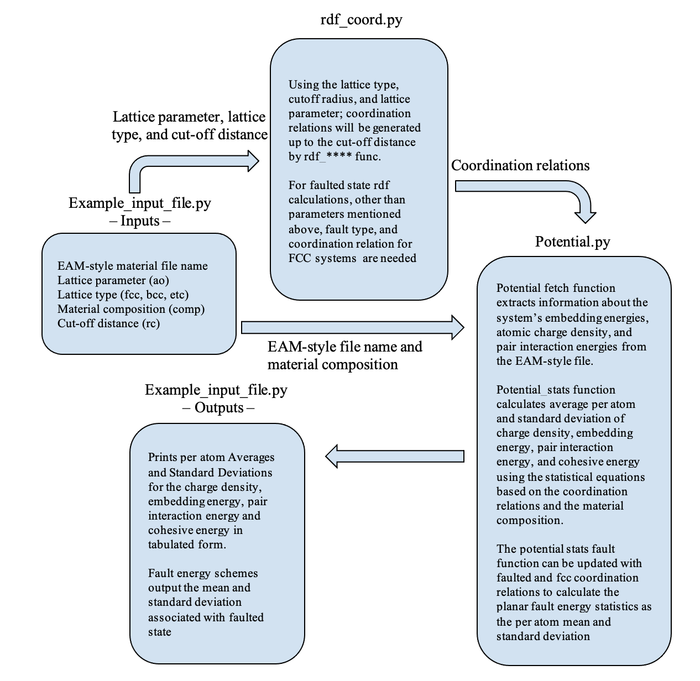

Overview:
Hello! This program calculates the statistics of the cohesive energies and planar fault energies of your system of choice. This program requires an embedded atom method (EAM) file, in the setfl format, that describes the interatomic interactions in your system. You must also provide the composition of your material (comp), the lattice parameter (ao), the lattice type of your material (fcc, bcc, etc.), and the desired cut-off distance (rc). This repository provides one example input file and two Python libraries named Example_input_file.py, rdf_coord.py, and Potential.py, respectively. The block diagram below describes their usage:

These codes were built using Python 3.8.3 and the NumPy Python Package. More information on Python and NumPy can be found in the Extra Information section.

How to Cite:
This program leverages the statistical equations described in Jagatramka et al. [Insert Ref here] to generate statistics for the energy landscapes. Please cite this paper when using this code. This code is free to redistribute under the GPL-3.0 license. 

Authors:
- Ritesh Jagatramka, University of Illinois at Chicago
- Chu Wang, University of Illinois at Chicago (now at Nissan)
- Ariana Sofia Del Valle, University of Illinois at Chicago  
- Matthew Daly, University of Illinois at Chicago 

How to calculate the cohesive energy statistics:
To calculate the Cohesive energy statistics for your system of choice, please follow these directions:
1.	Select your desired system ensuring it is an EAM potential in the setfl filetype. NIST provides an extensive repository of freely available potentials: 
https://www.ctcms.nist.gov/potentials/. 
More information about the EAM-style can be found here: 
https://docs.lammps.org/pair_eam.html. 
Ensure that your potential file is located in the same file directory/location as the codes.
2.	Open the Example_input_file.py code file using a script editor or IDE of choice. Some IDE suggestions are listed in the additional information section. Enter the inputs as follows:

a.	Enter your desired value for lattice parameter in Angstroms, cut-off distance in Angstroms, and the composition of your material as the mole fraction of each element. For example, for a NiCo system that is 40% Ni and 60% Co by mole with a lattice parameter of 3.512Å and a cut-off distance of 6.5Å, the inputs would appear as shown below. 
Note: The composition of your alloy should be written as a mole fraction that adds to 1. The dimensionality of the comp array defines the number of system components. 

b.	To generate the coordination relations for your material based on the chosen lattice parameter, lattice type, and cut-off distance, in the rc.rdf_coord_###(ao,rcut) variable, write hcp, bcc, or fcc where there is ### such that it matches your system of choice. For example, if the material has an fcc crystal structure, the variable will be written as rc.rdf_coord_fcc, as seen below:

 
Similarly, for hcp and bcc respectively,
 

 
c.	Enter the name of your EAM potential file under the fname variable as a string (in between quotations). For example, A NiCo system whose EAM-file is named NiCo-lamps-2014.alloy will be inputted as follows:

 
3.	After providing each variable with the required input, run the Example_input_file.py file using your terminal of choice. The code will generate Cohesive energy values as a data table if the correct parameters and EAM-file are inputted. Otherwise, errors will occur.
4.	To check if the EAM file is being read correctly, open the Potential.py file and remove the ‘#’ in the print statements in the EAM parsing function of the file. Then, run the Example_input_file.py script. The script will return values for chem, Nrho, drho, Nr, and dr. In a setfl file, the fourth line contains information about the number of elements in the system (chem) and the fifth line contains information about the number of atomic density values (Nrho), the spacing in density (drho), the number of distance values (Nr), and the spacing in distance (dr). Compare the returned values with those in the EAM file. Additionally, the script will print a value for cols, which represents the number of data columns in the EAM file. Ensure that this value matches the number of columns present in the EAM file. If any of these values are parsed incorrectly, the file type is likely not in the setfl format. 

Cohesive energy statistics examples:
To test the code, utilize the aforementioned instructions using the provided NiCo and FeNiCr systems. For Ni0.40Co0.60, a lattice parameter of 3.512Å, a cut-off distance of 6.5Å, an FCC structure, a composition of 40% Ni and 60% Co, and the file name will generate the following statistics in eV/atom units:

 
Similarly, for Fe0.33Ni0.33Cr0.34, a lattice parameter of 3.5225Å, a cut-off distance of 5.6Å, an fcc structure, a composition of 33% Fe, 33% Ni, and 34% Cr, and the file name will generate the following statistics in eV/atom units:

 
These examples are provided as practice and it is encouraged to replicate the above results before inputting your system of choice.

How to calculate the interplanar fault energy statistics:
To calculate the interplanar fault energy statistics for your system of choice, please follow the following directions:
1.	Follow all the steps for the cohesive energy calculations and then proceed to step 2 below.
2.	To generate the faulted state coordination relations for your material update the chosen lattice parameter, lattice type, and cut-off distance, in the function shown below:
Here, in rc.rdf_coord_fault(ao, rcut, cn, ii), ao, rcut, and cn are lattice parameters, cutoff radius, and coordination relation for the fcc system, respectively; lastly, ii is fault type. For example, if NiCo material has an fcc orientation and has an intrinsic stacking fault (ISF) then, the variable will be written as rc.rdf_coord_fault, as seen below:
3.	The next step is to update the coordination relations for fault obtained in step 2 to calculate the energy statistics associated with your system of system. In the following input command, there are three additional variables, when compared with cohesive energy calculations. They are the faulted coordination relations (written as globals()[‘cn_’+ii]), the fcc energy (written as form_E) statistics, and the separate solute-level average per atom cohesive energy of each element in the system for instance Ni and Co in a NiCo solid solution ensemble (written as E_element, see [xxx add ref] for further details) 

4.	The final step is to run the code!!!

Interplanar fault energy statistics examples:
To test the code, utilize the aforementioned instructions using the provided NiCo and FeNiCr systems. For Ni0.40Co0.60, a lattice parameter of 3.512Å, a cut-off distance of 6.5Å, an fcc structure, a composition of 40%Ni and 60%Co, and the file name for the fault (for eg. ISF, etc.) will generate the following statistics in eV/atom units:

Similarly, for Fe0.33Ni0.33Cr0.34, a lattice parameter of 3.5225Å, a cut-off distance of 5.6Å, an fcc structure, a composition of 33%Fe, 33%Ni, and 34%Cr, and the fault file name (for eg. ISF, etc.) will generate the following statistics in eV/atom units:
These examples are provided as practice and it is encouraged to replicate the above results before inputting your system of choice.

 

Additional Information:
- Python Documentation and Installation Resource: 
 - https://www.python.org/ 
- Documentation on NumPy Python package: https://numpy.org/doc/stable/user/index.html#user
- Recommended Python IDEs:
 - Pycharm Professional, Community, and Education Editions
 - Spyder IDE
